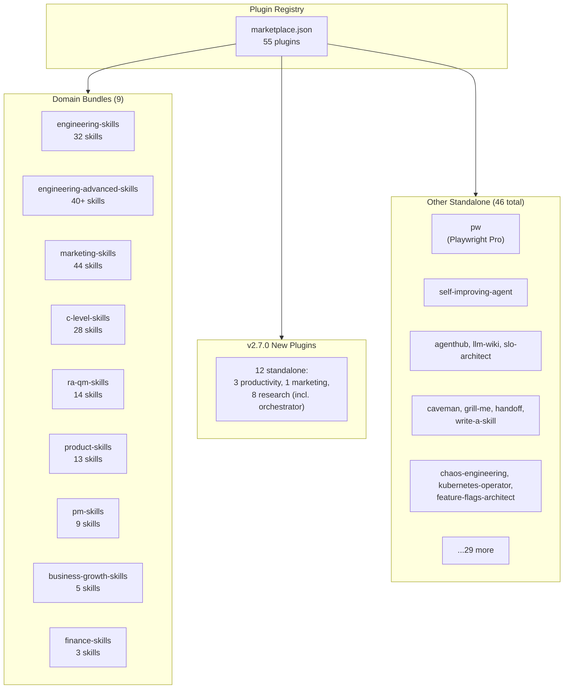

<div class="skills-hero" markdown>

# Plugins & Marketplace

**55 installable plugins** — 9 domain bundles + 46 standalone packages distributed via Claude Code plugin registry and ClawHub.

<p class="skills-hero-sub">Install entire skill domains or individual tools with a single command. Compatible with Claude Code, OpenAI Codex, Gemini CLI, and OpenClaw.</p>

</div>

---

## At a Glance

<div class="grid cards" markdown>

-   :material-puzzle-outline:{ .lg .middle } **55 Plugins**

    ---

    9 domain bundles + 46 standalone packages

-   :material-domain:{ .lg .middle } **12 Domains**

    ---

    Engineering (Core + POWERFUL), Marketing, Product, C-Level, PM, RA/QM, Business, Finance, Productivity ✨v2.7.0, Marketing-top-level ✨v2.7.0, Research ✨v2.7.0

-   :material-toolbox-outline:{ .lg .middle } **311 Skills**

    ---

    All skills available through plugin install

-   :material-sync:{ .lg .middle } **4 Platforms**

    ---

    Claude Code, OpenAI Codex, Gemini CLI, OpenClaw — single repo, all platforms

</div>

---

## Quick Install

=== "Claude Code"

    ```bash
    # Add the marketplace
    /plugin marketplace add alirezarezvani/claude-skills

    # Install a domain bundle
    /plugin install engineering-skills@claude-code-skills

    # Or install a standalone plugin (v2.7.0 example)
    /plugin install research-orchestrator@claude-code-skills
    ```

=== "OpenAI Codex"

    ```bash
    git clone https://github.com/alirezarezvani/claude-skills.git
    cd claude-skills
    ./scripts/codex-install.sh
    ```

=== "Gemini CLI"

    ```bash
    git clone https://github.com/alirezarezvani/claude-skills.git
    cd claude-skills
    python3 scripts/sync-gemini-skills.py --verbose
    ```

=== "OpenClaw"

    ```bash
    curl -sL https://raw.githubusercontent.com/alirezarezvani/claude-skills/main/scripts/openclaw-install.sh | bash
    ```

---

## Plugin Architecture



---

## Domain Bundles

Domain bundles install an entire skill domain with all its tools, references, and assets. Use these when you want comprehensive coverage for a functional area.

### :material-trending-up: Business & Growth

| | |
|---|---|
| **Plugin** | `business-growth-skills` |
| **Skills** | 5 |
| **Install** | `claude /plugin install business-growth-skills` |

Customer success manager, sales engineer, revenue operations, contract & proposal writer, BizDev toolkit.

[:octicons-arrow-right-24: Browse skills](../skills/business-growth/index.md)

---

### :material-shield-check-outline: Regulatory & Quality

| | |
|---|---|
| **Plugin** | `ra-qm-skills` |
| **Skills** | 14 |
| **Install** | `claude /plugin install ra-qm-skills` |

ISO 13485 QMS, MDR 2017/745, FDA 510(k)/PMA, GDPR/DSGVO, ISO 27001 ISMS, EU AI Act, ISO 42001, CAPA management, risk management, clinical evaluation for HealthTech/MedTech.

[:octicons-arrow-right-24: Browse skills](../skills/ra-qm-team/index.md)

---

### :material-rocket-launch: Engineering — POWERFUL

| | |
|---|---|
| **Plugin** | `engineering-advanced-skills` |
| **Skills** | 40+ |
| **Install** | `claude /plugin install engineering-advanced-skills` |

Agent designer, RAG architect, database designer, migration architect, observability designer, dependency auditor, release manager, API reviewer, CI/CD pipeline builder, MCP server builder, AgentHub, llm-wiki, slo-architect, chaos-engineering, kubernetes-operator, feature-flags-architect, ship-gate, plus the 4 Matt Pocock skills (write-a-skill, caveman, grill-me, handoff).

[:octicons-arrow-right-24: Browse skills](../skills/engineering/index.md)

---

### :material-code-braces: Engineering — Core

| | |
|---|---|
| **Plugin** | `engineering-skills` |
| **Skills** | 32 |
| **Install** | `claude /plugin install engineering-skills` |

Architecture, frontend, backend, fullstack, QA, DevOps, security, AI/ML, data engineering, Playwright Pro (9 sub-skills), self-improving agent, Stripe integration, TDD guide, tech stack evaluator, Google Workspace CLI, a11y audit, 6-skill security suite.

[:octicons-arrow-right-24: Browse skills](../skills/engineering-team/index.md)

---

### :material-calculator-variant: Finance

| | |
|---|---|
| **Plugin** | `finance-skills` |
| **Skills** | 3 |
| **Install** | `claude /plugin install finance-skills` |

Financial analyst (DCF valuation, budgeting, forecasting), SaaS metrics coach (ARR, MRR, churn, CAC, LTV, NRR), business investment advisor.

[:octicons-arrow-right-24: Browse skills](../skills/finance/index.md)

---

### :material-account-tie: C-Level Advisory

| | |
|---|---|
| **Plugin** | `c-level-skills` |
| **Skills** | 28 |
| **Install** | `claude /plugin install c-level-skills` |

Full C-suite (10 roles: CEO, CTO, CFO, COO, CPO, CMO, CRO, CISO, CHRO, GC, CDO, CAIO, CCO, VPE), executive mentor, founder coach, board meetings, decision logger, scenario war room, competitive intel, M&A playbook, culture frameworks.

[:octicons-arrow-right-24: Browse skills](../skills/c-level-advisor/index.md)

---

### :material-bullhorn-outline: Marketing

| | |
|---|---|
| **Plugin** | `marketing-skills` |
| **Skills** | 44 |
| **Install** | `claude /plugin install marketing-skills` |

Content, SEO, CRO, Channels, Growth, Intelligence, Sales enablement, and X/Twitter growth. 51 Python tools, 73 reference docs across 7 specialist pods.

[:octicons-arrow-right-24: Browse skills](../skills/marketing-skill/index.md)

---

### :material-lightbulb-outline: Product

| | |
|---|---|
| **Plugin** | `product-skills` |
| **Skills** | 13 |
| **Install** | `claude /plugin install product-skills` |

Product manager toolkit (RICE, PRDs), agile product owner, product strategist, UX researcher, UI design system, competitive teardown, landing page generator, SaaS scaffolder, product analytics, experiment designer, product discovery, roadmap communicator, code-to-prd, apple-hig-expert.

[:octicons-arrow-right-24: Browse skills](../skills/product-team/index.md)

---

### :material-clipboard-check-outline: Project Management

| | |
|---|---|
| **Plugin** | `pm-skills` |
| **Skills** | 9 |
| **Install** | `claude /plugin install pm-skills` |

Senior PM, scrum master, Jira expert, Confluence expert, Atlassian admin, template creator. 12 Python tools with bundled Atlassian Remote MCP integration.

[:octicons-arrow-right-24: Browse skills](../skills/project-management/index.md)

---

## v2.7.0 Standalone Plugins ✨

Thirteen new Path-B megaprompt-derived skills shipped in v2.7.0 across three new top-level domain folders.

### Productivity (3 plugins)

| Plugin | Skills | Install |
|---|:-:|---|
| `capture-skill` | 1 | `claude /plugin install capture-skill` — brain-dump-to-action workspace |
| `email-pair` | 2 | `claude /plugin install email-pair` — paired inbox-setup + inbox-triage with 7-file KB contract |
| `reflect-skill` | 1 | `claude /plugin install reflect-skill` — light-prompt journal sibling of capture |

### Marketing (top-level — 1 plugin)

| Plugin | Skills | Install |
|---|:-:|---|
| `landing` | 1 | `claude /plugin install landing` — single-file HTML landing-page generator (4 design styles, GSAP, brand palette validator) |

### Research (8 plugins)

| Plugin | Skills | Install |
|---|:-:|---|
| `research-orchestrator` | 1 | `claude /plugin install research-orchestrator` — **hybrid router + fallback**. Classifies + routes to 6 specialists or runs own workflow. |
| `pulse` | 1 | `claude /plugin install pulse` — multi-source recency research (Reddit/HN/X/web) |
| `litreview` | 1 | `claude /plugin install litreview` — academic literature (PICO/SPIDER frameworks) |
| `grants` | 1 | `claude /plugin install grants` — NIH grant-funding intelligence |
| `dossier` | 1 | `claude /plugin install dossier` — decision-grade entity research |
| `patent` | 1 | `claude /plugin install patent` — patent prior-art + IP landscape |
| `syllabus` | 1 | `claude /plugin install syllabus` — course supplementary reading (bundled DOCX generator) |
| `notebooklm` | 1 | `claude /plugin install notebooklm` — Google NotebookLM browser automation |

---

## Other Standalone Plugins

Standalone plugins install individual skills or toolkits. Use these when you need a specific capability without the full domain bundle.


| Plugin | Category | Source |
|---|---|---|
| `apple-hig-expert` | design | `./product-team/apple-hig-expert` |
| `a11y-audit` | development | `./engineering-team/a11y-audit` |
| `agenthub` | development | `./engineering/agenthub` |
| `autoresearch-agent` | development | `./engineering/autoresearch-agent` |
| `caveman` | development | `./engineering/caveman` |
| `chaos-engineering` | development | `./engineering/chaos-engineering` |
| `code-tour` | development | `./engineering/code-tour` |
| `data-quality-auditor` | development | `./engineering/data-quality-auditor` |
| `demo-video` | development | `./engineering/demo-video` |
| `docker-development` | development | `./engineering/docker-development` |
| `feature-flags-architect` | development | `./engineering/feature-flags-architect` |
| `google-workspace-cli` | development | `./engineering-team/google-workspace-cli` |
| `grill-me` | development | `./engineering/grill-me` |
| `handoff` | development | `./engineering/handoff` |
| `helm-chart-builder` | development | `./engineering/helm-chart-builder` |
| `karpathy-coder` | development | `./engineering/karpathy-coder` |
| `kubernetes-operator` | development | `./engineering/kubernetes-operator` |
| `pw` | development | `./engineering-team/playwright-pro` |
| `self-improving-agent` | development | `./engineering-team/self-improving-agent` |
| `slo-architect` | development | `./engineering/slo-architect` |
| `statistical-analyst` | development | `./engineering/statistical-analyst` |
| `terraform-patterns` | development | `./engineering/terraform-patterns` |
| `write-a-skill` | development | `./engineering/write-a-skill` |
| `llm-wiki` | knowledge | `./engineering/llm-wiki` |
| `c-level-agents` | leadership | `./c-level-advisor/c-level-agents` |
| `chief-ai-officer-advisor` | leadership | `./c-level-advisor/chief-ai-officer-advisor` |
| `chief-customer-officer-advisor` | leadership | `./c-level-advisor/chief-customer-officer-advisor` |
| `chief-data-officer-advisor` | leadership | `./c-level-advisor/chief-data-officer-advisor` |
| `executive-mentor` | leadership | `./c-level-advisor/executive-mentor` |
| `general-counsel-advisor` | leadership | `./c-level-advisor/general-counsel-advisor` |
| `vpe-advisor` | leadership | `./c-level-advisor/vpe-advisor` |
| `agile-product-owner` | product | `./product-team/agile-product-owner` |
| `code-to-prd` | product | `./product-team/code-to-prd` |
| `research-summarizer` | product | `./product-team/research-summarizer` |


---

## Plugin Structure

Every plugin follows the same minimal schema for maximum portability:

```json
{
  "name": "plugin-name",
  "description": "What it does",
  "version": "2.7.0",
  "author": { "name": "Author Name" },
  "homepage": "https://...",
  "repository": "https://...",
  "license": "MIT",
  "skills": ["./skills/<name>"]
}
```

Two approved extension fields permitted (per CLAUDE.md ClawHub rule #5):

- **`source`** (object) — provenance metadata for Path-B megaprompt-derived skills. Used by all 13 v2.7.0 skills (productivity, marketing, research).
- **`attribution`** (object) — credit metadata for MIT-licensed external derivatives. Used by `caveman`, `grill-me`, `grill-with-docs`.

!!! info "ClawHub Registry"
    Plugins are distributed via [ClawHub](https://clawhub.com) as the public registry. The `cs-` prefix is used only when a slug is already taken by another publisher — repo folder names remain unchanged.

---

## Compatibility Matrix

| Platform | Bundle Install | Standalone Install | Slash Commands | Agents |
|----------|:-:|:-:|:-:|:-:|
| **Claude Code** | :material-check: | :material-check: | :material-check: | :material-check: |
| **OpenAI Codex** | :material-check: | :material-check: | :material-close: | :material-close: |
| **Gemini CLI** | :material-check: | :material-check: | :material-close: | :material-close: |
| **OpenClaw** | :material-check: | :material-check: | :material-close: | :material-close: |

!!! tip "Full feature support"
    Slash commands (like `/cs:research`, `/pw:generate`) and agent spawning (like `cs-research`) are Claude Code features. On other platforms, the underlying skills and Python tools work — just without the command/agent wrappers.

---

## All 55 Plugins at a Glance

| Plugin | Type | Category | Source |
|---|---|---|---|
| `business-growth-skills` | Bundle | business-growth | `./business-growth` |
| `ra-qm-skills` | Bundle | compliance | `./ra-qm-team` |
| `engineering-advanced-skills` | Bundle | development | `./engineering` |
| `engineering-skills` | Bundle | development | `./engineering-team` |
| `finance-skills` | Bundle | finance | `./finance` |
| `c-level-skills` | Bundle | leadership | `./c-level-advisor` |
| `marketing-skills` | Bundle | marketing | `./marketing-skill` |
| `product-skills` | Bundle | product | `./product-team` |
| `pm-skills` | Bundle | project-management | `./project-management` |
| `apple-hig-expert` | Standalone | design | `./product-team/apple-hig-expert` |
| `a11y-audit` | Standalone | development | `./engineering-team/a11y-audit` |
| `agenthub` | Standalone | development | `./engineering/agenthub` |
| `autoresearch-agent` | Standalone | development | `./engineering/autoresearch-agent` |
| `caveman` | Standalone | development | `./engineering/caveman` |
| `chaos-engineering` | Standalone | development | `./engineering/chaos-engineering` |
| `code-tour` | Standalone | development | `./engineering/code-tour` |
| `data-quality-auditor` | Standalone | development | `./engineering/data-quality-auditor` |
| `demo-video` | Standalone | development | `./engineering/demo-video` |
| `docker-development` | Standalone | development | `./engineering/docker-development` |
| `feature-flags-architect` | Standalone | development | `./engineering/feature-flags-architect` |
| `google-workspace-cli` | Standalone | development | `./engineering-team/google-workspace-cli` |
| `grill-me` | Standalone | development | `./engineering/grill-me` |
| `handoff` | Standalone | development | `./engineering/handoff` |
| `helm-chart-builder` | Standalone | development | `./engineering/helm-chart-builder` |
| `karpathy-coder` | Standalone | development | `./engineering/karpathy-coder` |
| `kubernetes-operator` | Standalone | development | `./engineering/kubernetes-operator` |
| `pw` | Standalone | development | `./engineering-team/playwright-pro` |
| `self-improving-agent` | Standalone | development | `./engineering-team/self-improving-agent` |
| `slo-architect` | Standalone | development | `./engineering/slo-architect` |
| `statistical-analyst` | Standalone | development | `./engineering/statistical-analyst` |
| `terraform-patterns` | Standalone | development | `./engineering/terraform-patterns` |
| `write-a-skill` | Standalone | development | `./engineering/write-a-skill` |
| `llm-wiki` | Standalone | knowledge | `./engineering/llm-wiki` |
| `c-level-agents` | Standalone | leadership | `./c-level-advisor/c-level-agents` |
| `chief-ai-officer-advisor` | Standalone | leadership | `./c-level-advisor/chief-ai-officer-advisor` |
| `chief-customer-officer-advisor` | Standalone | leadership | `./c-level-advisor/chief-customer-officer-advisor` |
| `chief-data-officer-advisor` | Standalone | leadership | `./c-level-advisor/chief-data-officer-advisor` |
| `executive-mentor` | Standalone | leadership | `./c-level-advisor/executive-mentor` |
| `general-counsel-advisor` | Standalone | leadership | `./c-level-advisor/general-counsel-advisor` |
| `vpe-advisor` | Standalone | leadership | `./c-level-advisor/vpe-advisor` |
| `landing` ✨ | Standalone | marketing | `./marketing/landing` |
| `agile-product-owner` | Standalone | product | `./product-team/agile-product-owner` |
| `code-to-prd` | Standalone | product | `./product-team/code-to-prd` |
| `research-summarizer` | Standalone | product | `./product-team/research-summarizer` |
| `capture-skill` ✨ | Standalone | productivity | `./productivity/capture` |
| `email-pair` ✨ | Standalone | productivity | `./productivity/email` |
| `reflect-skill` ✨ | Standalone | productivity | `./productivity/reflect` |
| `dossier` ✨ | Standalone | research | `./research/dossier` |
| `grants` ✨ | Standalone | research | `./research/grants` |
| `litreview` ✨ | Standalone | research | `./research/litreview` |
| `notebooklm` ✨ | Standalone | research | `./research/notebooklm` |
| `patent` ✨ | Standalone | research | `./research/patent` |
| `pulse` ✨ | Standalone | research | `./research/pulse` |
| `research-orchestrator` ✨ | Standalone | research | `./research/research` |
| `syllabus` ✨ | Standalone | research | `./research/syllabus` |

---

## FAQ

??? question "What's the difference between a bundle and a standalone plugin?"
    **Bundles** install all skills in a domain (e.g., `marketing-skills` installs all 44 marketing skills). **Standalone** plugins install a single skill or toolkit (e.g., `pulse` installs just the recency-research skill). Standalone plugins are subsets of their parent bundle when applicable — installing both is safe but redundant.

??? question "What are the v2.7.0 plugins?"
    Twelve new plugins covering 13 skills shipped in v2.7.0 across three new top-level domains: **productivity** (capture-skill, email-pair, reflect-skill), **marketing** top-level (landing), and **research** (research-orchestrator + 7 specialists: pulse, litreview, grants, dossier, patent, syllabus, notebooklm). All Path-B converted from `megaprompts/01-13`.

??? question "What is the research orchestrator?"
    `research-orchestrator` is a **hybrid router + fallback** that classifies any research question deterministically and either delegates to one of 6 specialists (pulse, litreview, grants, dossier, patent, syllabus, notebooklm) at ≥2-signal confidence, OR runs its own 8-step plan-decompose-search-synthesize-cite workflow when no specialist matches. Routing transparency is mandatory — it never delegates silently. Distinct from `engineering/autoresearch-agent` (Karpathy's file-optimization loop).

??? question "Can I install multiple plugins?"
    Yes. Plugins are designed to coexist without conflicts. Each skill is self-contained with no cross-dependencies.

??? question "Do plugins require API keys or paid services?"
    No. All Python tools use stdlib only. Some skills reference external services (AWS, Google Workspace, Stripe, NIH RePORTER, Reddit/HN APIs) but follow a BYOK (bring-your-own-key) pattern — you use your own accounts.

??? question "How do I update plugins?"
    Re-run the install command. Plugins follow semantic versioning aligned with the repository releases (currently v2.7.0).

??? question "What is ClawHub?"
    [ClawHub](https://clawhub.com) is the public registry for Claude Code plugins. Think of it like npm for AI agent skills. The `cs-` prefix is used only when a plugin slug conflicts with another publisher.

??? question "Can I use skills without installing anything?"
    Yes. We have [6 Custom GPTs for ChatGPT](../custom-gpts.md) that package Agent Skills into a conversational interface — no installation, no API keys. Just click and chat.
