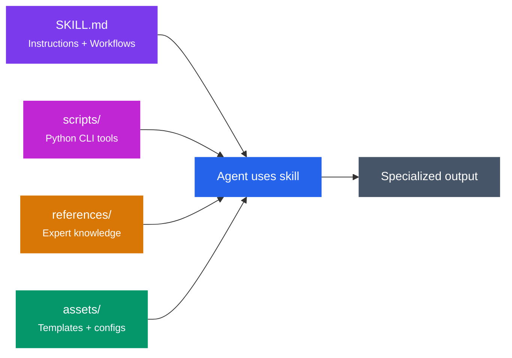
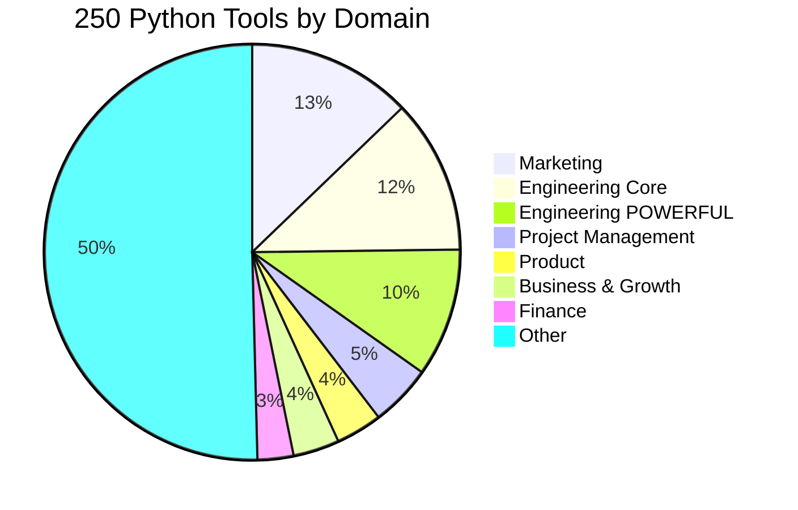

<div class="skills-hero" markdown>

# Skills Library

Browse 177 production-ready skills across 9 domains.
{ .skills-hero-sub }

</div>

<div class="grid cards" markdown>

-   :material-counter:{ .lg .middle } **177 Skills**

    ---

    Across 9 professional domains

-   :material-language-python:{ .lg .middle } **250 Tools**

    ---

    Python CLI tools, all stdlib-only

-   :material-package-variant-closed:{ .lg .middle } **19 Plugins**

    ---

    Install bundles or individual skills

-   :material-devices:{ .lg .middle } **4 Platforms**

    ---

    Claude Code, Codex, Gemini, OpenClaw

</div>

## Quick Install

=== "Claude Code"

    ```bash
    # Add the marketplace
    /plugin marketplace add alirezarezvani/claude-skills

    # Install any skill bundle
    /plugin install engineering-skills@claude-code-skills
    /plugin install marketing-skills@claude-code-skills
    /plugin install c-level-skills@claude-code-skills
    ```

=== "Gemini CLI"

    ```bash
    git clone https://github.com/alirezarezvani/claude-skills.git
    cd claude-skills && python3 scripts/sync-gemini-skills.py
    ```

=== "OpenAI Codex"

    ```bash
    git clone https://github.com/alirezarezvani/claude-skills.git
    cd claude-skills && python3 scripts/sync-codex-skills.py
    ```

=== "OpenClaw"

    ```bash
    git clone https://github.com/alirezarezvani/claude-skills.git
    cd claude-skills && bash scripts/openclaw-install.sh
    ```

[Full Install Guide :octicons-arrow-right-24:](../getting-started.md){ .md-button .md-button--primary }
[GitHub :fontawesome-brands-github:](https://github.com/alirezarezvani/claude-skills){ .md-button }

---

## Architecture

Every skill follows the same self-contained package pattern — no cross-dependencies, no external APIs, no setup required:



---

## Domains at a Glance

<div class="grid cards" markdown>

-   :material-cog:{ .lg .middle } **Engineering — Core** <span class="skill-count">24</span>

    ---

    Full-stack engineering team: architecture, frontend, backend, DevOps, security, AI/ML, data, QA, plus Playwright testing, self-improving agent, Google Workspace CLI, and Stripe integration.

    **30+ Python tools** | 3 sub-skill trees

    [:octicons-arrow-right-24: Browse skills](engineering-team/index.md){ .md-button .md-button--primary }

-   :material-lightning-bolt:{ .lg .middle } **Engineering — POWERFUL** <span class="skill-count">25</span>

    ---

    Advanced engineering capabilities: agent designer, RAG architect, MCP server builder, CI/CD pipelines, database design, observability, security auditing, release management.

    **Platform-level tools** for building infrastructure

    [:octicons-arrow-right-24: Browse skills](engineering/index.md){ .md-button .md-button--primary }

-   :material-bullhorn:{ .lg .middle } **Marketing** <span class="skill-count">43</span>

    ---

    Complete marketing division across 7 specialist pods — content, SEO, CRO, channels, growth hacking, intelligence, and sales enablement. Plus X/Twitter growth tools.

    **32 Python tools** | Foundation context system

    [:octicons-arrow-right-24: Browse skills](marketing-skill/index.md){ .md-button .md-button--primary }

-   :material-star-circle:{ .lg .middle } **C-Level Advisory** <span class="skill-count">28</span>

    ---

    Virtual board of directors: CEO, CTO, COO, CPO, CMO, CFO, CRO, CISO, CHRO. Board meeting orchestration, decision logger, scenario war room, M&A playbook, culture frameworks.

    **10 executive roles** | Strategic alignment engine

    [:octicons-arrow-right-24: Browse skills](c-level-advisor/index.md){ .md-button .md-button--primary }

-   :material-bullseye-arrow:{ .lg .middle } **Product** <span class="skill-count">8</span>

    ---

    Product manager toolkit (RICE scoring, PRDs), agile product owner, strategist, UX researcher, UI design system, competitive teardown, landing page generator, SaaS scaffolder.

    **9 Python tools** | Next.js TSX + Tailwind output

    [:octicons-arrow-right-24: Browse skills](product-team/index.md){ .md-button .md-button--primary }

-   :material-clipboard-check:{ .lg .middle } **Project Management** <span class="skill-count">6</span>

    ---

    Senior PM, scrum master, Jira expert, Confluence expert, Atlassian admin, and template creator. Live MCP integration for Jira/Confluence automation.

    **12 Python tools** | Atlassian MCP integration

    [:octicons-arrow-right-24: Browse skills](project-management/index.md){ .md-button .md-button--primary }

-   :material-shield-check:{ .lg .middle } **Regulatory & Quality** <span class="skill-count">12</span>

    ---

    HealthTech/MedTech compliance: ISO 13485 QMS, MDR 2017/745, FDA 510(k)/PMA, ISO 27001 ISMS, GDPR/DSGVO, CAPA management, risk management (ISO 14971), clinical evaluation.

    **Enterprise compliance** | Audit-ready documentation

    [:octicons-arrow-right-24: Browse skills](ra-qm-team/index.md){ .md-button .md-button--primary }

-   :material-trending-up:{ .lg .middle } **Business & Growth** <span class="skill-count">4</span>

    ---

    Customer success manager with health scoring and churn prediction, sales engineer with RFP analysis, revenue operations with pipeline metrics, contract & proposal writer.

    **9 Python tools** | GTM strategy support

    [:octicons-arrow-right-24: Browse skills](business-growth/index.md){ .md-button .md-button--primary }

-   :material-currency-usd:{ .lg .middle } **Finance** <span class="skill-count">2</span>

    ---

    Financial analyst (ratio analysis, DCF valuation, budgeting, forecasting) and SaaS metrics coach (ARR, MRR, churn, CAC, LTV, NRR, Quick Ratio, projections).

    **7 Python tools** | Industry benchmarks built-in

    [:octicons-arrow-right-24: Browse skills](finance/index.md){ .md-button .md-button--primary }

</div>

---

## Skills by Category

=== ":material-cog: Engineering"

    **49 skills** across Core and POWERFUL tiers.

    ??? note "Core Engineering (24 skills)"

        | Skill | Focus |
        |-------|-------|
        | [Senior Architect](engineering-team/senior-architect.md) | System design, trade-offs, ADRs |
        | [Senior Frontend](engineering-team/senior-frontend.md) | React, Next.js, performance |
        | [Senior Backend](engineering-team/senior-backend.md) | Node.js, APIs, databases |
        | [Senior Fullstack](engineering-team/senior-fullstack.md) | End-to-end development |
        | [Senior QA](engineering-team/senior-qa.md) | Test strategy, automation |
        | [Senior DevOps](engineering-team/senior-devops.md) | CI/CD, infrastructure |
        | [Senior SecOps](engineering-team/senior-secops.md) | Security operations |
        | [Senior Security](engineering-team/senior-security.md) | AppSec, vulnerability assessment |
        | [Senior ML Engineer](engineering-team/senior-ml-engineer.md) | Model deployment, MLOps |
        | [Senior Data Scientist](engineering-team/senior-data-scientist.md) | Statistics, experiments |
        | [Senior Data Engineer](engineering-team/senior-data-engineer.md) | Pipelines, ETL, data quality |
        | [Senior Prompt Engineer](engineering-team/senior-prompt-engineer.md) | Prompt optimization, RAG |
        | [Senior Computer Vision](engineering-team/senior-computer-vision.md) | Object detection, segmentation |
        | [Code Reviewer](engineering-team/code-reviewer.md) | Code quality analysis |
        | [AWS Solution Architect](engineering-team/aws-solution-architect.md) | Serverless, IaC, cost optimization |
        | [MS365 Tenant Manager](engineering-team/ms365-tenant-manager.md) | Microsoft 365 administration |
        | [Google Workspace CLI](engineering-team/google-workspace-cli.md) | Gmail, Drive, Sheets via gws CLI |
        | [Stripe Integration](engineering-team/stripe-integration-expert.md) | Payments, subscriptions |
        | [TDD Guide](engineering-team/tdd-guide.md) | Test-driven development |
        | [Tech Stack Evaluator](engineering-team/tech-stack-evaluator.md) | Technology selection |
        | [Playwright Pro](engineering-team/playwright-pro.md) | E2E testing (9 sub-skills) |
        | [Self-Improving Agent](engineering-team/self-improving-agent.md) | Memory curation (5 sub-skills) |
        | [Email Template Builder](engineering-team/email-template-builder.md) | HTML email templates |
        | [Incident Commander](engineering-team/incident-commander.md) | Incident response |

    ??? note "POWERFUL Engineering (25 skills)"

        | Skill | Focus |
        |-------|-------|
        | [Agent Designer](engineering/agent-designer.md) | Multi-agent system architecture |
        | [Agent Workflow Designer](engineering/agent-workflow-designer.md) | Agent orchestration patterns |
        | [RAG Architect](engineering/rag-architect.md) | Retrieval-augmented generation |
        | [MCP Server Builder](engineering/mcp-server-builder.md) | Model Context Protocol servers |
        | [Database Designer](engineering/database-designer.md) | Schema design, optimization |
        | [Database Schema Designer](engineering/database-schema-designer.md) | ERD, migrations |
        | [CI/CD Pipeline Builder](engineering/ci-cd-pipeline-builder.md) | GitHub Actions, GitLab CI |
        | [Migration Architect](engineering/migration-architect.md) | System migration planning |
        | [Observability Designer](engineering/observability-designer.md) | Monitoring, tracing, alerting |
        | [Performance Profiler](engineering/performance-profiler.md) | Bottleneck analysis |
        | [Skill Security Auditor](engineering/skill-security-auditor.md) | Vulnerability scanning |
        | [Dependency Auditor](engineering/dependency-auditor.md) | Supply chain security |
        | [API Design Reviewer](engineering/api-design-reviewer.md) | REST/GraphQL review |
        | [API Test Suite Builder](engineering/api-test-suite-builder.md) | API test generation |
        | [PR Review Expert](engineering/pr-review-expert.md) | Pull request analysis |
        | [Tech Debt Tracker](engineering/tech-debt-tracker.md) | Debt scoring, prioritization |
        | [Changelog Generator](engineering/changelog-generator.md) | Keep a Changelog format |
        | [Codebase Onboarding](engineering/codebase-onboarding.md) | New developer guides |
        | [Runbook Generator](engineering/runbook-generator.md) | Operations documentation |
        | [Git Worktree Manager](engineering/git-worktree-manager.md) | Parallel development |
        | [Monorepo Navigator](engineering/monorepo-navigator.md) | Monorepo workflows |
        | [Env & Secrets Manager](engineering/env-secrets-manager.md) | Configuration management |
        | [Interview System Designer](engineering/interview-system-designer.md) | Technical interviews |
        | [Skill Tester](engineering/skill-tester.md) | Skill quality validation |

=== ":material-bullhorn: Marketing"

    **43 skills** across 7 specialist pods.

    ??? note "Content & Copy (8 skills)"

        | Skill | Focus |
        |-------|-------|
        | [Content Creator](marketing-skill/content-creator.md) | SEO-optimized content |
        | [Copywriting](marketing-skill/copywriting.md) | Conversion copy frameworks |
        | [Brand Guidelines](marketing-skill/brand-guidelines.md) | Voice consistency |
        | [Content Strategy](marketing-skill/content-strategy.md) | Editorial calendars |
        | [Content Humanizer](marketing-skill/content-humanizer.md) | Natural AI-free writing |
        | [Ad Creative](marketing-skill/ad-creative.md) | Ad copy and creative |
        | [Content Production](marketing-skill/content-production.md) | Content briefs and workflows |
        | [Copy Editing](marketing-skill/copy-editing.md) | Style and grammar |

    ??? note "SEO & Analytics (7 skills)"

        | Skill | Focus |
        |-------|-------|
        | [SEO Audit](marketing-skill/seo-audit.md) | Technical SEO analysis |
        | [App Store Optimization](marketing-skill/app-store-optimization.md) | ASO strategy |
        | [Schema Markup](marketing-skill/schema-markup.md) | Structured data |
        | [Analytics Tracking](marketing-skill/analytics-tracking.md) | Tag management |
        | [Campaign Analytics](marketing-skill/campaign-analytics.md) | Campaign metrics |
        | [A/B Test Setup](marketing-skill/ab-test-setup.md) | Experiment design |

    ??? note "Growth, Channels & More (28 skills)"

        Includes CRO, demand generation, social media, paid ads, PR, partnerships, competitive intelligence, sales enablement, X/Twitter growth, and more. [Browse all marketing skills :octicons-arrow-right-24:](marketing-skill/index.md)

=== ":material-star-circle: C-Level"

    **28 skills** — 10 executive roles plus orchestration and strategic tools.

    ??? note "Executive Roles (10)"

        | Role | Focus |
        |------|-------|
        | [CEO Advisor](c-level-advisor/ceo-advisor.md) | Vision, fundraising, product-market fit |
        | [CTO Advisor](c-level-advisor/cto-advisor.md) | Architecture, tech debt, build vs buy |
        | [COO Advisor](c-level-advisor/coo-advisor.md) | Operations, scaling, process |
        | [CPO Advisor](c-level-advisor/cpo-advisor.md) | Product strategy, roadmaps |
        | [CMO Advisor](c-level-advisor/cmo-advisor.md) | Brand, GTM, demand generation |
        | [CFO Advisor](c-level-advisor/cfo-advisor.md) | Finance, burn rate, fundraising |
        | [CRO Advisor](c-level-advisor/cro-advisor.md) | Revenue, sales, pipeline |
        | [CISO Advisor](c-level-advisor/ciso-advisor.md) | Security, compliance, risk |
        | [CHRO Advisor](c-level-advisor/chro-advisor.md) | People, culture, org design |
        | [Executive Mentor](c-level-advisor/executive-mentor.md) | Coaching (5 sub-skills) |

    ??? note "Orchestration & Strategy (18)"

        Board meetings, Chief of Staff, decision logger, board deck builder, scenario war room, competitive intelligence, M&A playbook, culture architect, founder coach, and more. [Browse all C-level skills :octicons-arrow-right-24:](c-level-advisor/index.md)

=== ":material-bullseye-arrow: Product & PM"

    **14 skills** across Product and Project Management.

    | Skill | Domain | Focus |
    |-------|--------|-------|
    | [Product Manager Toolkit](product-team/product-manager-toolkit.md) | Product | RICE scoring, PRDs, roadmaps |
    | [Agile Product Owner](product-team/agile-product-owner.md) | Product | Backlog, sprints, user stories |
    | [Product Strategist](product-team/product-strategist.md) | Product | OKRs, market analysis |
    | [UX Researcher](product-team/ux-researcher-designer.md) | Product | User research, design |
    | [UI Design System](product-team/ui-design-system.md) | Product | Component libraries |
    | [Competitive Teardown](product-team/competitive-teardown.md) | Product | Feature comparison |
    | [Landing Page Generator](product-team/landing-page-generator.md) | Product | Next.js TSX + Tailwind |
    | [SaaS Scaffolder](product-team/saas-scaffolder.md) | Product | Full SaaS boilerplate |
    | [Senior PM](project-management/senior-pm.md) | PM | Portfolio management |
    | [Scrum Master](project-management/scrum-master.md) | PM | Sprint facilitation |
    | [Jira Expert](project-management/jira-expert.md) | PM | JQL, workflows |
    | [Confluence Expert](project-management/confluence-expert.md) | PM | Documentation |
    | [Atlassian Admin](project-management/atlassian-admin.md) | PM | Platform administration |
    | [Template Creator](project-management/atlassian-templates.md) | PM | Reusable templates |

=== ":material-shield-check: Compliance & Finance"

    **14 skills** for regulated industries and financial analysis.

    ??? note "Regulatory & Quality (12 skills)"

        | Skill | Standard |
        |-------|----------|
        | [ISO 13485 QMS](ra-qm-team/quality-manager-qms-iso13485.md) | Quality Management System |
        | [MDR 745 Specialist](ra-qm-team/mdr-745-specialist.md) | EU MDR 2017/745 |
        | [FDA Consultant](ra-qm-team/fda-consultant-specialist.md) | 510(k), PMA submissions |
        | [GDPR/DSGVO Expert](ra-qm-team/gdpr-dsgvo-expert.md) | Data protection |
        | [ISO 27001 ISMS](ra-qm-team/information-security-manager-iso27001.md) | Information security |
        | [ISMS Audit Expert](ra-qm-team/isms-audit-expert.md) | Security auditing |
        | [CAPA Officer](ra-qm-team/capa-officer.md) | Corrective actions |
        | [Risk Management](ra-qm-team/risk-management-specialist.md) | ISO 14971 |
        | [QMS Audit Expert](ra-qm-team/qms-audit-expert.md) | Internal audits |
        | [Document Control](ra-qm-team/quality-documentation-manager.md) | SOP management |
        | [Quality Manager QMR](ra-qm-team/quality-manager-qmr.md) | Management reviews |
        | [Regulatory Affairs](ra-qm-team/regulatory-affairs-head.md) | Market access |

    ??? note "Finance (2 skills)"

        | Skill | Focus |
        |-------|-------|
        | [Financial Analyst](finance/financial-analyst.md) | DCF valuation, ratio analysis, budgeting, forecasting |
        | [SaaS Metrics Coach](finance/saas-metrics-coach.md) | ARR, MRR, churn, CAC, LTV, NRR, Quick Ratio |

    ??? note "Business & Growth (4 skills)"

        | Skill | Focus |
        |-------|-------|
        | [Customer Success Manager](business-growth/customer-success-manager.md) | Health scoring, churn prediction |
        | [Sales Engineer](business-growth/sales-engineer.md) | RFP analysis, demo prep |
        | [Revenue Operations](business-growth/revenue-operations.md) | Pipeline metrics, GTM |
        | [Contract & Proposal Writer](business-growth/contract-and-proposal-writer.md) | SOWs, proposals |

---

## Python Tools Distribution



!!! tip "All tools are stdlib-only"
    Every Python script uses only the standard library — zero `pip install` required. All 250 tools are verified passing `--help`. Scripts support both human-readable and `--json` output for automation.

---

## How Skills Work

<div class="grid cards" markdown>

-   :material-numeric-1-circle:{ .lg .middle } **Install**

    ---

    Add a skill bundle or individual skill via the plugin marketplace.

    ```bash
    /plugin install engineering-skills@claude-code-skills
    ```

-   :material-numeric-2-circle:{ .lg .middle } **Trigger**

    ---

    Skills activate automatically when your prompt matches their domain — or invoke directly.

-   :material-numeric-3-circle:{ .lg .middle } **Execute**

    ---

    The agent follows SKILL.md workflows, runs Python tools for analysis, and references expert knowledge bases.

-   :material-numeric-4-circle:{ .lg .middle } **Output**

    ---

    Get structured, actionable results — reports, code, configurations, strategies, or documentation.

</div>

